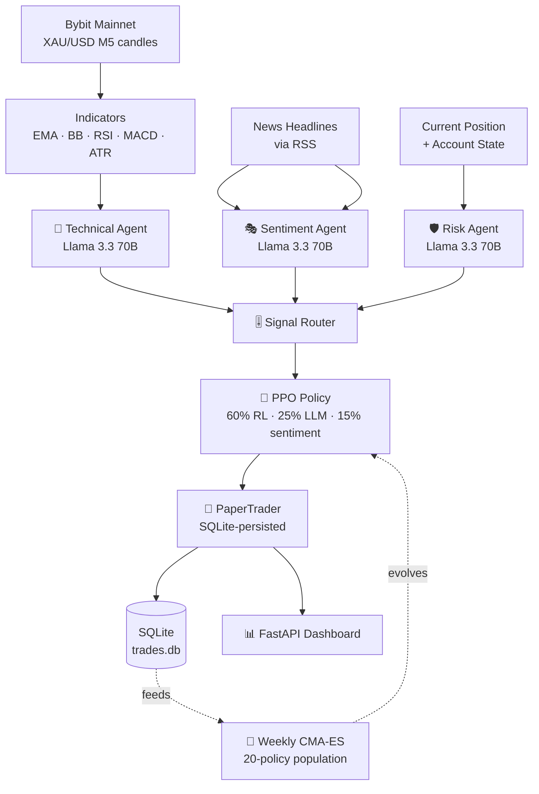

<div align="center">

# ⚡ XAUUSD AI Trading Bot

### *24/7 Autonomous Gold Trading · Multi-Agent LLM × Evolutionary Reinforcement Learning*

<p>
  
  
  
  
  
  
  
</p>

<p>
  <b>🤖 3 LLM Agents</b> &nbsp;·&nbsp;
  <b>🧠 PPO Policy</b> &nbsp;·&nbsp;
  <b>🧬 Weekly Evolution</b> &nbsp;·&nbsp;
  <b>📊 Real-time Dashboard</b> &nbsp;·&nbsp;
  <b>☁️ Free-tier Cloud</b>
</p>

---

</div>

> A self-improving gold (XAU/USD) trading bot that fuses three LLM agents (technical, sentiment, risk) with a PPO reinforcement-learning policy, then evolves the policy weekly using CMA-ES to chase higher Sharpe. Runs continuously on free-tier infrastructure.

<div align="center">

## ✨ Highlights

</div>

| 🎯 | **Multi-Agent Brain** | 3 Groq Llama 3.3 70B agents analyze charts, news, and risk — vote on every trade |
| :-: | :--- | :--- |
| 🧠 | **RL Decision Engine** | PPO policy fuses LLM signals + market state → continuous action ∈ [-1, 1] |
| 🧬 | **Self-Evolving** | Weekly CMA-ES cycle on a population of policies; the fittest gets promoted |
| 💾 | **Persistent State** | SQLite-backed positions, balance, realized PnL — restart-safe |
| 📈 | **Pro Dashboard** | Light-themed FastAPI UI: candles, RSI/MACD/ATR, equity curve, win-rate, DD |
| 🌐 | **Always-On** | Designed for Oracle Cloud Always-Free tier (4 OCPU / 24 GB ARM) |
| 💸 | **Zero Cost** | Every dependency on a free tier — Groq, Bybit Testnet, Oracle Cloud |

<div align="center">

## 🏗️ Architecture

</div>



<div align="center">

## 🚀 Quick Start

</div>

### 1️⃣ Get free API keys

| Service | Link | What you need |
| :-- | :-- | :-- |
| **Bybit Testnet** | [testnet.bybit.com](https://testnet.bybit.com) | API Key + Secret |
| **Groq** | [console.groq.com](https://console.groq.com) | API Key (free 30 RPM / 1000 RPD) |

### 2️⃣ Configure

```bash
cp config/.env.example config/.env
# Fill in: BYBIT_API_KEY, BYBIT_API_SECRET, GROQ_API_KEY
```

### 3️⃣ Install

```bash
pip install -r requirements.txt
```

### 4️⃣ Smoke test

```bash
python scripts/test_connection.py
```

### 5️⃣ Train baseline RL policy *(one-time)*

```bash
python src/rl/train.py --train-start 2022-01-01 --train-end 2023-12-31
# → models/baseline_ppo.zip
```

### 6️⃣ Backtest *(optional)*

```bash
python src/backtest/run_backtest.py --start 2024-01-01 --end 2024-06-01
# → results/backtest_*.html
```

### 7️⃣ Launch the bot

```bash
python -m src.scheduler          # 5-min trading loop + daily + weekly evolution
python -m src.dashboard.server   # Dashboard at http://localhost:8080
```

<div align="center">

## 📊 Dashboard

</div>

A **light-themed FastAPI dashboard** with:

- 📌 **Position Panel** — side, size, entry, mark, unrealized PnL %, exposure
- 📈 **6 KPI Cards** — NAV · Today PnL · Realized PnL · Win Rate · Max Drawdown · Total Trades
- 🕯️ **TradingView-style Live Chart** — candles + toggleable EMA50/EMA200/Bollinger/Volume/RSI/MACD/ATR
- ⚙️ **Indicator Settings** — adjust RSI thresholds, candle count; state persists in localStorage
- 📜 **Trade Log** — filterable by Buy/Sell/Close, full LLM reasoning per trade
- 🧬 **RL Fitness** — Sharpe per generation across evolutionary cycles
- 🍩 **Signal Distribution** — Buy/Sell/Hold breakdown

<div align="center">

## 🧠 How It Works

</div>

### Trading Loop *(every 5 minutes)*

```
1. Fetch M5 candles + compute indicators (EMA, BB, RSI, MACD, ATR)
2. Fetch market headlines (RSS)
3. 🎯 3× LLM agents → technical signal · sentiment score · risk veto
4. 🧠 PPO policy → continuous action (-1 short ↔ +1 long)
5. 🎚️ Router blends: 60% RL + 25% LLM + 15% sentiment → target size
6. 🛡️ Circuit breaker: skip if daily DD ≥ threshold
7. 📒 PaperTrader executes — fills at mid-price ± half-spread, charges commission
8. 💾 Persist to SQLite (paper_portfolio, trades, snapshots)
```

### Weekly Evolution *(Mondays 02:00 UTC)*

```
1. Load last 14 days of paper trades
2. Evaluate population of 20 PPO policies on this window
3. CMA-ES selects fittest by Sharpe ratio
4. Promote best → models/best_policy.zip
5. Router hot-reloads — next loop uses the new champion
```

<div align="center">

## ⚙️ Configuration

</div>

All knobs live in [`config/config.yaml`](config/config.yaml). Highlights:

| Key | Default | Purpose |
| :-- | :-- | :-- |
| `trading.qty` | `0.01` | Base position size in oz |
| `trading.loop_interval_minutes` | `5` | Trading-loop cadence |
| `risk.max_daily_drawdown` | `0.03` | Hard circuit-breaker (3%) |
| `risk.min_llm_confidence` | `0.6` | Minimum LLM confidence to act |
| `rl.population_size` | `20` | Evolutionary pool size |
| `llm.model` | `llama-3.3-70b-versatile` | Groq model |

<div align="center">

## 🛠️ Stack

</div>

| Layer | Tech | Free? |
| :-- | :-- | :-: |
| 🤖 **LLM** | Groq Llama 3.3 70B | ✅ |
| 🧠 **RL** | Stable-Baselines3 PPO | ✅ |
| 🧬 **Evolution** | EvoTorch CMA-ES | ✅ |
| 📡 **Market Data** | Bybit public API (mainnet prices) | ✅ |
| 📒 **Execution** | PaperTrader (virtual $100k) | ✅ |
| 🌐 **API/Dashboard** | FastAPI + Uvicorn | ✅ |
| 📈 **Charts** | lightweight-charts + Chart.js | ✅ |
| 💾 **Storage** | SQLite (via SQLAlchemy) | ✅ |
| ⏰ **Scheduler** | APScheduler | ✅ |
| ☁️ **Hosting** | Oracle Cloud Always Free (4 OCPU / 24 GB) | ✅ |

<div align="center">

## 📁 Project Structure

</div>

```
bot-trading/
├── 📂 src/
│   ├── 🤖 agents/         # LLM agents — technical · sentiment · risk
│   ├── 🧠 rl/             # Gym env · PPO trainer · CMA-ES evolution · daily fine-tune
│   ├── 📡 data/           # Bybit fetcher · news fetcher
│   ├── 📒 execution/      # PaperTrader (SQLite-backed) · BybitBroker
│   ├── 📊 dashboard/      # FastAPI server + light-themed UI
│   ├── 🧪 backtest/       # Walk-forward backtest runner
│   ├── 🎚️ router.py       # Signal fusion: LLM + RL → decision
│   ├── ⏰ scheduler.py     # 24/7 loop · daily report · weekly evolution
│   └── 💾 db.py           # SQLAlchemy models + helpers
├── 📂 config/
│   ├── config.yaml        # All tunable parameters
│   └── .env.example       # API key template
├── 📂 scripts/            # Smoke tests, ad-hoc tools
├── 📂 deploy/             # Oracle Cloud systemd setup
├── 📂 models/             # Trained policies (gitignored)
├── 📂 logs/               # bot.log · trades.db (gitignored)
└── 📂 notebooks/          # Exploration / analysis
```

<div align="center">

## 🌐 Deploy to Oracle Cloud Always Free

</div>

```bash
# On a fresh Oracle Cloud ARM instance (Ubuntu 22.04+)
bash deploy/oracle_setup.sh

# Open dashboard port in Oracle Security List:
#   Source: 0.0.0.0/0   Port: 8080   Protocol: TCP
```

The setup script installs systemd units that auto-restart the bot + dashboard on failure or reboot.

<div align="center">

## 🗺️ Roadmap

</div>

- [x] Paper trader with persistent SQLite state
- [x] FastAPI dashboard with light theme + indicator toggles
- [x] Weekly CMA-ES evolution
- [x] Daily PPO fine-tuning on yesterday's data
- [ ] Backtest comparison: pure-LLM vs pure-RL vs fused
- [ ] Multi-symbol support (XAU/USD + BTC/USD)
- [ ] Telegram alerts on trade events
- [ ] Live trading switch (with extra safety gates)

<div align="center">

## 📜 License

MIT — use it, fork it, break it. No warranty.

---

<sub>Built with caffeine and skepticism. Paper-trading only — past performance does not predict future results. 🥃</sub>

</div>
